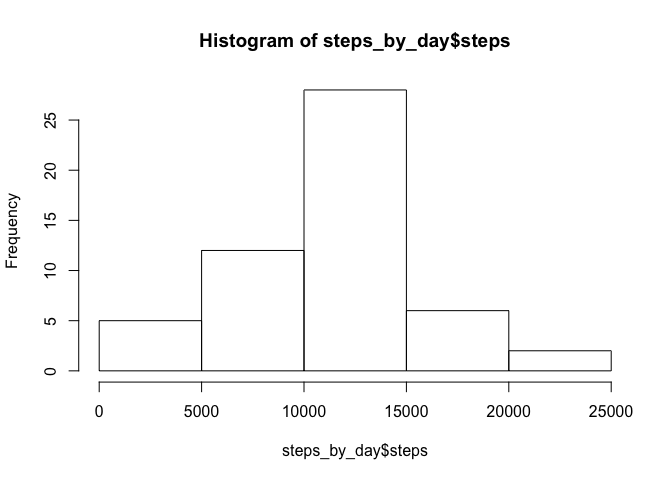
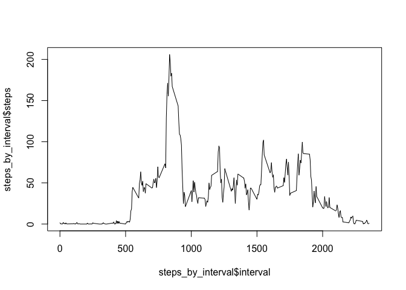
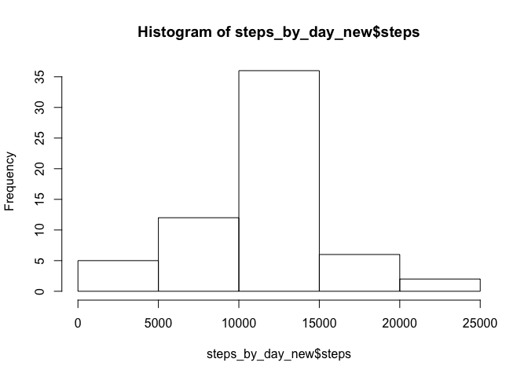
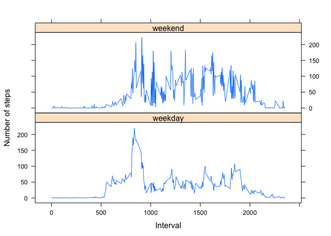

    knitr::opts_chunk$set(fig.path = "./")
    knitr::opts_chunk$set(echo = TRUE)

This document contains a report that answers the questions posed by the
second week assignment in a single R markdown document processed by
knitr and transformed into an HTML file.

Loading the data into suitable format
-------------------------------------

This first step loads the original csv data into a data frame
denominated "DATA":

    DATA<-read.csv("activity.csv")
    summary(DATA)

    ##      steps                date          interval     
    ##  Min.   :  0.00   2012-10-01:  288   Min.   :   0.0  
    ##  1st Qu.:  0.00   2012-10-02:  288   1st Qu.: 588.8  
    ##  Median :  0.00   2012-10-03:  288   Median :1177.5  
    ##  Mean   : 37.38   2012-10-04:  288   Mean   :1177.5  
    ##  3rd Qu.: 12.00   2012-10-05:  288   3rd Qu.:1766.2  
    ##  Max.   :806.00   2012-10-06:  288   Max.   :2355.0  
    ##  NA's   :2304     (Other)   :15840

What is mean total number of steps taken per day?
-------------------------------------------------

1.  Calculation of the total number of steps taken per day:

<!-- -->

    steps_by_day<-aggregate(DATA$steps[!is.na(DATA$steps)], list(DATA$date[!is.na(DATA$steps)]), sum, na.rm=FALSE)
    colnames(steps_by_day) <- c("date", "steps")
    steps_by_day

    ##          date steps
    ## 1  2012-10-02   126
    ## 2  2012-10-03 11352
    ## 3  2012-10-04 12116
    ## 4  2012-10-05 13294
    ## 5  2012-10-06 15420
    ## 6  2012-10-07 11015
    ## 7  2012-10-09 12811
    ## 8  2012-10-10  9900
    ## 9  2012-10-11 10304
    ## 10 2012-10-12 17382
    ## 11 2012-10-13 12426
    ## 12 2012-10-14 15098
    ## 13 2012-10-15 10139
    ## 14 2012-10-16 15084
    ## 15 2012-10-17 13452
    ## 16 2012-10-18 10056
    ## 17 2012-10-19 11829
    ## 18 2012-10-20 10395
    ## 19 2012-10-21  8821
    ## 20 2012-10-22 13460
    ## 21 2012-10-23  8918
    ## 22 2012-10-24  8355
    ## 23 2012-10-25  2492
    ## 24 2012-10-26  6778
    ## 25 2012-10-27 10119
    ## 26 2012-10-28 11458
    ## 27 2012-10-29  5018
    ## 28 2012-10-30  9819
    ## 29 2012-10-31 15414
    ## 30 2012-11-02 10600
    ## 31 2012-11-03 10571
    ## 32 2012-11-05 10439
    ## 33 2012-11-06  8334
    ## 34 2012-11-07 12883
    ## 35 2012-11-08  3219
    ## 36 2012-11-11 12608
    ## 37 2012-11-12 10765
    ## 38 2012-11-13  7336
    ## 39 2012-11-15    41
    ## 40 2012-11-16  5441
    ## 41 2012-11-17 14339
    ## 42 2012-11-18 15110
    ## 43 2012-11-19  8841
    ## 44 2012-11-20  4472
    ## 45 2012-11-21 12787
    ## 46 2012-11-22 20427
    ## 47 2012-11-23 21194
    ## 48 2012-11-24 14478
    ## 49 2012-11-25 11834
    ## 50 2012-11-26 11162
    ## 51 2012-11-27 13646
    ## 52 2012-11-28 10183
    ## 53 2012-11-29  7047

*Note: na.rm=TRUE for aggregation renders an erroneus result given that
it takes into account days with NA as days with 0 observatyions. Thus
this is the correct methodology.*

1.  Histogram of the total number of steps taken each day:

<!-- -->

    hist(steps_by_day$steps)

1.  Calculation of the mean and the median of the total number of steps
    taken per day:

<!-- -->

    print(mean_steps<-mean(steps_by_day$steps))

    ## [1] 10766.19

    print(median_steps<-median(steps_by_day$steps))

    ## [1] 10765

What is the average daily activity pattern?
-------------------------------------------

1.  Time series plot (i.e. 𝚝𝚢𝚙𝚎 = "𝚕") of the 5-minute interval (x-axis)
    and the average number of steps taken, averaged across all days
    (y-axis):

<!-- -->

    steps_by_interval<-aggregate(DATA$steps, list(DATA$interval), mean, na.rm=TRUE)
    colnames(steps_by_interval) <- c("interval", "steps")
    plot(steps_by_interval$interval, steps_by_interval$steps, type="l")

1.  5-minute interval, on average across all the days in the dataset,
    that contains the maximum number of steps:

<!-- -->

    steps_by_interval$interval[steps_by_interval$steps==max(steps_by_interval$steps)]

    ## [1] 835

Imputing missing values
-----------------------

1.  Total number of missing values in the dataset (i.e. the total number
    of rows with 𝙽𝙰s):

<!-- -->

    dim(DATA[is.na(DATA$steps)==TRUE,])[1]

    ## [1] 2304

1.  Strategy for filling in all of the missing values in the dataset:

Mean for that 5-minute interval for the days with data.

    replace <- function(interval) steps_by_interval[steps_by_interval$interval==interval,"steps"]

1.  New dataset that is equal to the original dataset but with the
    missing data filled in.

<!-- -->

    DATA_new<-DATA
    DATA_new[is.na(DATA_new$steps),"steps"]<-sapply(DATA_new[is.na(DATA_new$steps),"interval"],replace)
    head(DATA_new)

    ##       steps       date interval
    ## 1 1.7169811 2012-10-01        0
    ## 2 0.3396226 2012-10-01        5
    ## 3 0.1320755 2012-10-01       10
    ## 4 0.1509434 2012-10-01       15
    ## 5 0.0754717 2012-10-01       20
    ## 6 2.0943396 2012-10-01       25

1.  Histogram of the total number of steps taken each day

<!-- -->

    steps_by_day_new<-aggregate(DATA_new$steps, list(DATA_new$date), sum, na.rm=TRUE)
    colnames(steps_by_day_new) <- c("date", "steps")
    hist(steps_by_day_new$steps)

Mean and median total number of steps taken per day.

    print( mean_steps_new<-mean(steps_by_day_new$steps))

    ## [1] 10766.19

    print(median_steps_new<-median(steps_by_day_new$steps))

    ## [1] 10766.19

Do these values differ from the estimates from the first part of the
assignment? What is the impact of imputing missing data on the estimates
of the total daily number of steps?

*No change in mean and only negligible given that the average for each 5
minute interval was used and the fact that the NA values correspond to
whole days, thus the avergae of the new daily data is equal to the mean
of the original daily data.*

    mean_steps_new - mean_steps

    ## [1] 0

    median_steps_new - median_steps

    ## [1] 1.188679

Are there differences in activity patterns between weekdays and weekends?
-------------------------------------------------------------------------

1.  New factor variable in the dataset with two levels – “weekday” and
    “weekend” indicating whether a given date is a weekday or
    weekend day.

<!-- -->

    DATA_new$weekdays<-weekdays(as.Date(DATA_new$date))
    DATA_new[DATA_new$weekdays==c("Saturday", "Sunday"),"weekdays"]<-"weekend"
    DATA_new[DATA_new$weekdays!="weekend","weekdays"]<-"weekday"
    DATA_new$weekdays<-as.factor(DATA_new$weekdays)
    summary(DATA_new)

    ##      steps                date          interval         weekdays    
    ##  Min.   :  0.00   2012-10-01:  288   Min.   :   0.0   weekday:15264  
    ##  1st Qu.:  0.00   2012-10-02:  288   1st Qu.: 588.8   weekend: 2304  
    ##  Median :  0.00   2012-10-03:  288   Median :1177.5                  
    ##  Mean   : 37.38   2012-10-04:  288   Mean   :1177.5                  
    ##  3rd Qu.: 27.00   2012-10-05:  288   3rd Qu.:1766.2                  
    ##  Max.   :806.00   2012-10-06:  288   Max.   :2355.0                  
    ##                   (Other)   :15840

1.  Panel plot containing a time series plot of the 5-minute
    interval (x-axis) and the average number of steps taken, averaged
    across all weekday days or weekend days (y-axis).

<!-- -->

    steps_by_interval_new<-aggregate(DATA_new$steps,list(DATA_new$interval, DATA_new$weekdays),mean)
    colnames(steps_by_interval_new) <- c("interval", "weekdays","steps")
            
    library(lattice)

    xyplot(steps ~ interval | weekdays, steps_by_interval_new, type="l", xlab="Interval", ylab="Number of steps", layout=(c(1,2)))

